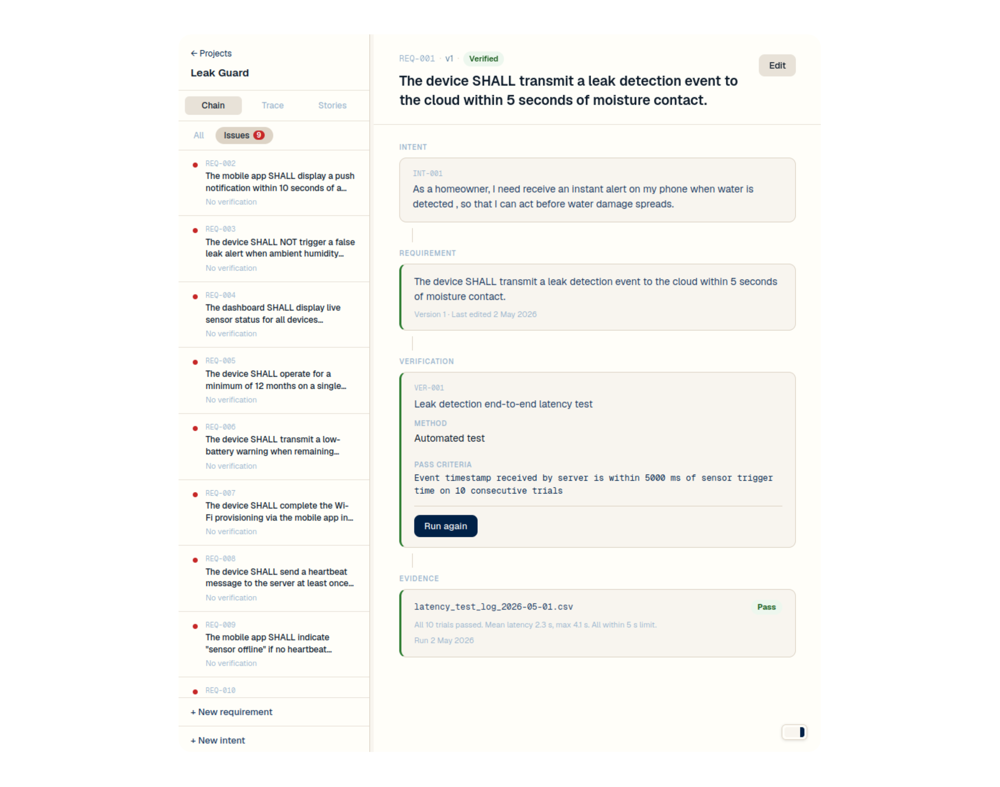
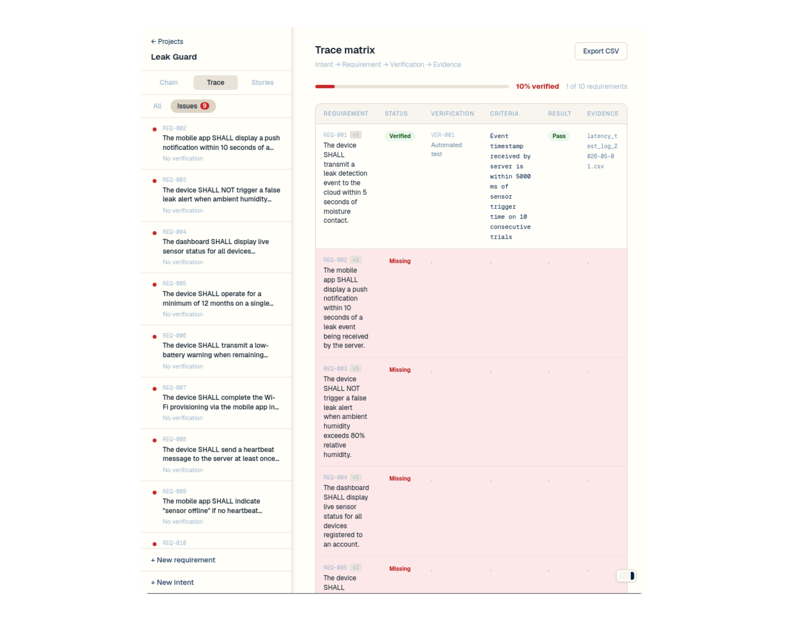
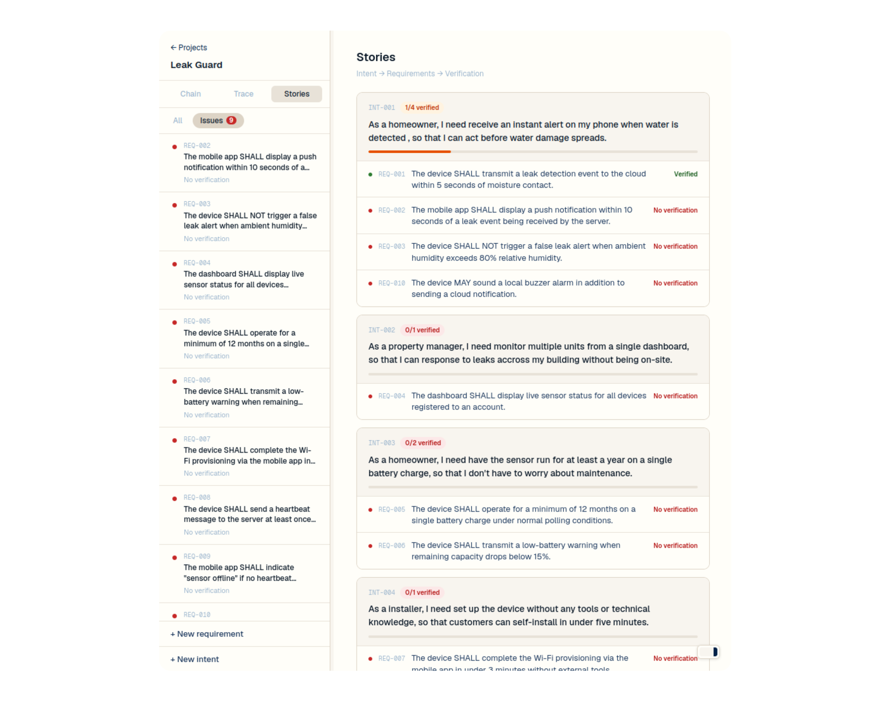

# Keystra Tracer

Every requirement justified, verified, and proven; no more broken links.

# **Try it out here: [keystra-tracer.vercel.app](https://keystra-tracer.vercel.app/auth/signin)**

## The idea

Most projects drift, and the rule-of-thumb is that 10% of your project requirements go stale each month. So when a requirement gets edited, the test that covered it no longer applies, and nobody notices until something breaks in the field.

Keystra aims to keep the chain intact: intent, requirement, verification, evidence.  Edit a requirement and anything that relied on the old version is immediately flagged as stale, no more silent breakage.

## Yay screenshots!

<table>
  <tr>
    <td></td>
    <td></td>
    <td></td>
  </tr>
  <tr>
    <td align="center">Requirement chain</td>
    <td align="center">Trace matrix</td>
    <td align="center">User stories</td>
  </tr>
</table>

## How it's built

Everything is an item: intent, requirement, verification, risk, evidence.

Relationships can `refine` (breaks intent into requirements), `verify` (links a verification to what it must prove), `produce` (attaches evidence to a run), `mitigate` (connects a risk to its control).

Six rules the engine enforces automatically:

- Requirements must be verifiable
- Verifications must define pass/fail criteria
- Verifications must produce evidence
- Editing a requirement invalidates its verification
- Risks must be mitigated and verified
- No orphan items - everything traces back to an intent

## What it doesn't do

No approval workflows, no diagramming, no enterprise reporting. 
A single engineer should get real value in under an hour.

## Stack

- [Next.js 14](https://nextjs.org) (App Router)
- [Supabase](https://supabase.com) (auth + database)
- TypeScript

## Running locally

```bash
npm install
# add your Supabase credentials to .env.local
npm run dev
```

Apply the schema: `db/migrations/001_schema.sql`

## License

[MIT](LICENSE)
